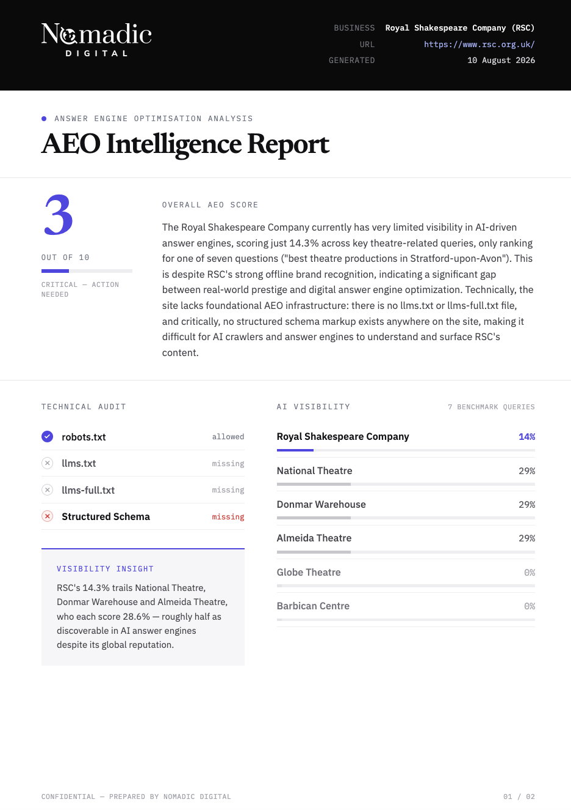

# AEO Intelligence Agent

**Automated agentic AI search visibility auditing — from a URL to a scored PDF report**


---

## Example Output



## The Problem

Search behaviour is shifting. ChatGPT, Claude, and Perplexity now answer questions that would previously have driven Google clicks — but most businesses have no idea whether they appear in those answers. Traditional SEO tools measure crawler signals; none of them measure whether an AI actually *mentions* your business when a potential customer asks a relevant question.

There is no Google Search Console equivalent for answer engines.

## The Solution

A multi-agent pipeline that takes a URL, autonomously researches the business, runs live visibility tests across Claude and returns a scored PDF report with a technical audit checklist, competitor comparison, and concrete recommendations — in under 90 seconds.

Built as a lead-generation tool for a digital agency's AEO consulting practice: the report demonstrates a prospect's visibility gap and creates the natural next step.

## The Impact

Audits that took half a day now take under 90 seconds, and run weekly for lead generation


---

## Pipeline Architecture

```
START
  └─▶ [research]
        ├─▶ [technical_audit]     ─┐
        └─▶ [visibility_analysis]  ┴─▶ [report] ──▶ END
```

Four LangGraph nodes. `technical_audit` and `visibility_analysis` fan out from `research` in parallel; LangGraph's fan-in gate holds `report` until both branches complete, then passes a merged state.

### What each agent does

**research** — Scrapes the target URL via Firecrawl, uses Claude to extract business name, description, and key competitors, and generates 5 AEO-relevant test queries tailored to the business.

**technical_audit** — Checks `robots.txt` for explicit AI crawler rules across 5 major bots (GPTBot, ClaudeBot, PerplexityBot, Google-Extended, OAI-SearchBot); probes for `llms.txt` and `llms-full.txt`; parses structured schema markup (JSON-LD) from raw HTML.

**visibility_analysis** — Uses Claude as the measurement instrument. Each generated query is fired as a real conversation; the agent checks whether the business (and each competitor) appears in the response. Produces a per-query breakdown and an aggregate visibility score.

**report** — Synthesises all signals via an LLM prompt; generates a branded PDF (score circle, tech checklist, visibility bar chart, quick win callout) using WeasyPrint + Jinja2; returns it as a binary `FileResponse` — nothing is stored.

---

## Stack

| Layer | Technology |
|---|---|
| Orchestration | [LangGraph](https://github.com/langchain-ai/langgraph) |
| LLM | Claude Haiku 4.5 (research, visibility) and Sonnet 5 (report) via LangChain Anthropic |
| Web scraping | [Firecrawl](https://firecrawl.dev) |
| PDF generation | WeasyPrint + Jinja2 |
| API | FastAPI + Pydantic |
| Auth | X-API-Key header, CORS allowlist |
| Containerisation | Docker (python:3.14-slim) |
| Deployment | Google Cloud Run (scale-to-zero) |
| CI/CD | Google Cloud Build (push-to-main trigger: test → build → deploy) |
| Secrets | GCP Secret Manager |
| Observability | LangSmith (EU endpoint) |
| Frontend | Astro + Netlify Functions (server-side API key proxy) |

---

## Production Architecture

```
Browser
  └─▶ Netlify Function          (adds X-API-Key, proxies request)
        └─▶ Cloud Run            (FastAPI container, scale-to-zero)
              └─▶ LangGraph pipeline
                    └─▶ PDF binary  ──▶ streamed back to browser download
```

The PDF is generated in-container and returned as a `FileResponse` — no object storage, no persistence. Cloud Run's scale-to-zero means cost is purely request-based. The Netlify Function acts as a server-side proxy so the internal API key is never exposed to the browser.

Secrets (API keys, internal auth token) are injected at runtime from GCP Secret Manager — never baked into the image or stored in plaintext.

---

## Hard Problems Solved

**1. LangGraph fan-out / fan-in race condition**

LangGraph's `add_conditional_edges` returns a list of node names to enable true parallel execution. An early version had duplicate `technical_audit → report` and `visibility_analysis → report` edges defined twice — once in the conditional return and once as explicit `add_edge` calls. This caused the report node to fire as soon as the *first* branch completed, silently discarding whichever branch finished second. Fixed by auditing the graph topology and ensuring each fan-in edge is declared exactly once.

**2. WeasyPrint's system-level pango dependency**

WeasyPrint requires `libpango` for PDF rendering — it is not a pip dependency and is not bundled with the wheel. On macOS, this required setting `DYLD_LIBRARY_PATH=/opt/homebrew/lib` *before* the WeasyPrint import (the dynamic linker reads it at import time, not at call time). On Linux/Docker, it required `apt-get install libpango-1.0-0 libpangoft2-1.0-0` in the Dockerfile's build stage. Neither failure mode produces a helpful error message — both surface as cryptic `OSError: cannot load library` crashes.

**3. Cloud Run module resolution**

The FastAPI app lives at `src/aeo_agent/main.py` and uses bare imports (`from graph import app`). Running `uvicorn src.aeo_agent.main:app` from `/app` caused `ModuleNotFoundError` because Python's module resolution starts from the working directory, not the file's location. Fixed with uvicorn's `--app-dir src/aeo_agent` flag, which inserts that path at the front of `sys.path` before import — no package restructuring required.

**4. CI/CD auth without service account keys**

The first CI/CD approach (GitHub Actions + Workload Identity Federation) was blocked by a GCP org policy that prevented external identity providers from being trusted. Switching to Google Cloud Build resolved this immediately: Cloud Build runs inside GCP and inherits the Cloud Build service account's IAM roles without requiring any credential configuration. The trigger fires on every push to `main` and deploys to Cloud Run in the same step.

**5. Using the LLM as the measurement instrument**

Measuring AI visibility means asking: *does this AI mention my client when answering a relevant question?* The most direct way to test that is to actually ask the AI. The `visibility_analysis` agent fires each query against Claude and checks for brand name mentions in the response. This is deliberately naïve — it measures one model, not all answer engines — but it is the only approach that captures the real signal (what the AI says) rather than a proxy (crawl access, structured data). The limitation is documented in the report output.

---

## Deliberate Tradeoffs

**Cloud Run over a persistent server** — AEO audits are bursty and low-volume. A scale-to-zero container means £0 at idle; the cold-start penalty (~2–3s) is immaterial against a 60–90s pipeline.

**Claude as judge over crawl-based visibility** — Scraping AI search results is fragile (paywalls, bot detection, rapidly changing UIs). Querying the model directly is stable, reproducible, and measures the actual output users see. The tradeoff is single-model coverage; multi-model support is the natural next step.

**FileResponse over object storage** — Reports are single-use and user-specific. Storing them in GCS or S3 adds infrastructure, access-control complexity, and a retention policy for no user benefit. Generating in-container and streaming the binary response is simpler and has the same UX outcome.

**Cloud Build over GitHub Actions** — Native GCP auth eliminates the credential bootstrapping problem entirely. The cost is vendor lock-in on the CI side, which is acceptable here since the entire stack is already GCP.

**Netlify Function proxy over public API** — Exposing the Cloud Run URL directly in frontend JavaScript would expose the internal API key. A thin server-side function adds one network hop but keeps secrets off the client permanently.

---

## Repo Structure

```
src/aeo_agent/
├── agents/
│   ├── research.py             # Business intelligence via Firecrawl + Claude
│   ├── technical_audit.py      # robots.txt, llms.txt, schema markup checks
│   ├── visibility_analysis.py  # Claude-as-judge visibility scoring
│   └── report.py               # LLM synthesis + PDF generation
├── templates/
│   └── report.html             # Jinja2 PDF template
├── graph.py                    # LangGraph pipeline definition
├── main.py                     # FastAPI entry point, auth, CORS
├── pdf_generator.py            # WeasyPrint rendering
└── state.py                    # Shared AgentState schema
tests/
├── test_api.py                 # FastAPI endpoint tests (mocked)
├── test_graph.py               # Graph topology tests
├── test_research.py            # Research agent unit tests
├── test_technical_audit.py     # Technical audit unit tests
├── test_visibility_analysis.py # Visibility agent unit tests
└── test_pipeline_smoke.py      # Full end-to-end smoke test (excluded from CI)
Dockerfile                      # python:3.14-slim + pango
cloudbuild.yaml                 # Test → build → push → Cloud Run deploy
```

---

## Running Locally

**1. Install dependencies**

```bash
pip install -r requirements-dev.txt   # app dependencies + pytest
brew install pango          # macOS only — required by WeasyPrint
```

**2. Configure environment**

```bash
cp .env.example .env
# Add FIRECRAWL_API_KEY and ANTHROPIC_API_KEY
```

**3. Start the API**

```bash
uvicorn main:app --reload --app-dir src/aeo_agent
```

**4. Generate a report**

```bash
curl -X POST http://localhost:8000/generate_report \
  -H "Content-Type: application/json" \
  -d '{"url": "https://example.com"}' \
  --output report.pdf
```

---

Built solo. Questions welcome — [LinkedIn](https://www.linkedin.com/in/matt-hall-ai) · matt@nomadicdigital.co.uk