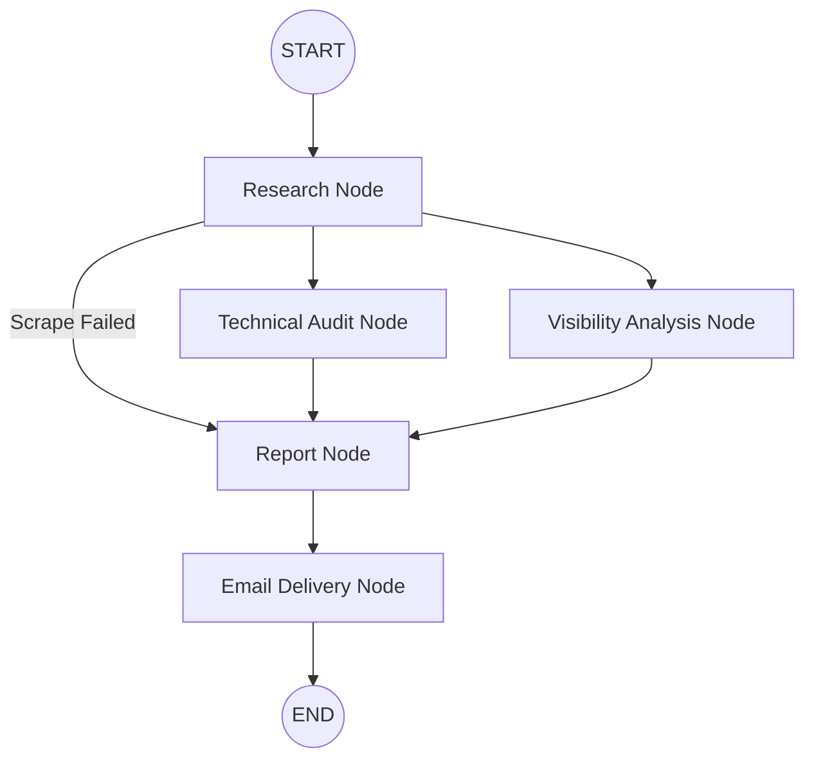

# AEO Intelligence Assistant - System Architecture

## 1. System Flow Diagram



---

## 2. Design Principles

### Fault Tolerance

Node failures should not terminate the workflow. Errors are captured in shared state and surfaced gracefully within the final report.

### Parallel Execution

Technical auditing and visibility analysis run concurrently to reduce overall execution time and improve user-facing latency. This is increasingly important for future planned use-cases of the app.

### Separation of Concerns

Each node owns a specific subset of the state and is responsible for a specific task.

### Deterministic State Management

All nodes communicate exclusively through `AgentState`, providing predictable execution, traceability, and easier debugging.

---

## 3. Data Model (AgentState)

The `AgentState` acts as the shared memory of the pipeline.

A strictly typed schema ensures consistency across all workflow stages. The `errors` field uses `operator.add` as a reducer, allowing multiple parallel nodes to append error messages without overwriting one another.

```python
from typing import TypedDict, List, Dict, Any, Annotated
import operator


class AgentState(TypedDict):
    # Input
    url: str
    email: str

    # System State
    errors: Annotated[List[str], operator.add]

    # Research
    business_name: str
    description: str
    competitors: List[str]
    core_queries: List[str]

    # Technical Audit
    llms_txt: Dict[str, Any]
    llms_full_txt: Dict[str, Any]
    robots_txt: Dict[str, Any]
    schema: Dict[str, Any]

    # Visibility Analysis
    prospect_visibility: Dict[str, int]
    competitor_visibility: Dict[str, Dict[str, int]]

    # Report
    overall_score: int
    high_level_summary: str
    pdf_path: str
```

---

## 4. State Ownership

Each node is responsible for updating a distinct portion of the shared state.

| Node                | State Fields Updated                                          |
| ------------------- | ------------------------------------------------------------- |
| Research            | `business_name`, `description`, `competitors`, `core_queries` |
| Technical Audit     | `llms_txt`, `llms_full_txt`, `robots_txt`, `schema`           |
| Visibility Analysis | `prospect_visibility`, `competitor_visibility`                |
| Report              | `overall_score`, `high_level_summary`, `pdf_path`             |

This ownership model enables safe parallel execution without state collisions.

---

## 5. Nodes (Worker Processes)

### Research Node

Responsible for:

* Extracting brand identity information
* Generating business descriptions
* Identifying competitors
* Building core visibility search queries

Updates:

* `business_name`
* `description`
* `competitors`
* `core_queries`

---

### Technical Audit Node

Responsible for:

* Evaluating `llms.txt`
* Evaluating `robots.txt`
* Inspecting technical metadata
* Assessing AI crawler accessibility

All operations are wrapped in error handling to prevent workflow failure.

Updates:

* `llms_txt`
* `llms_full_txt`
* `robots_txt`
* `schema`

---

### Visibility Analysis Node

Responsible for:

* Measuring brand visibility across AI search platforms
* Evaluating prospect visibility
* Comparing visibility against identified competitors

All operations are wrapped in error handling to prevent workflow failure.

Updates:

* `prospect_visibility`
* `competitor_visibility`

---

### Report Node

Responsible for:

* Aggregating outputs from all previous stages
* Evaluating collected errors
* Calculating scoring metrics
* Generating executive insights
* Producing the final PDF report

The Report Node generates output regardless of whether all upstream nodes completed successfully. Available data and captured errors are used to explain any missing analysis.

Updates:

* `overall_score`
* `high_level_summary`
* `pdf_path`

---

## 6. Execution Flow

### Stage 1: Entry Point

Workflow execution begins at the **Research Node**.

---

### Stage 2: Research Validation & Routing

The workflow evaluates the state after research completes.

#### Success Path

If sufficient research data is collected:

* Continue to Technical Audit
* Continue to Visibility Analysis

Both nodes execute concurrently.

#### Failure Path

If the website cannot be scraped or analysed:

* Skip analysis stages
* Route directly to the Report Node
* Generate a failure summary report

---

### Stage 3: Parallel Analysis

The following nodes run independently and concurrently:

* Technical Audit Node
* Visibility Analysis Node

This reduces overall workflow latency while maintaining separation of concerns.

---

### Stage 4: Fan-In & Report Generation

Execution pauses until all active analysis branches have completed.

The Report Node then:

1. Collects all state updates
2. Merges accumulated errors
3. Calculates scoring metrics
4. Generates executive insights
5. Produces the final PDF report

The generated file path is stored in:

```python
pdf_path
```

---

### Stage 5: Email Delivery & Completion

After report generation:

```text
Report → END
```

The workflow transitions to the final `END` state.

---

## 7. Architectural Benefits

### Scalability

Additional analysis nodes can be introduced without modifying existing node responsibilities.

### Extensibility

Future workflow stages such as CRM logging, Slack notifications, database persistence, or competitor deep-dives can be added as independent nodes.

### Reliability

Error aggregation allows the workflow to continue operating even when individual analysis components fail.

### Observability

The shared state model provides a complete execution trace, making debugging and monitoring straightforward when integrated with LangSmith.

### Performance

Parallel execution minimizes overall runtime by allowing independent analyses to run simultaneously.

```
```